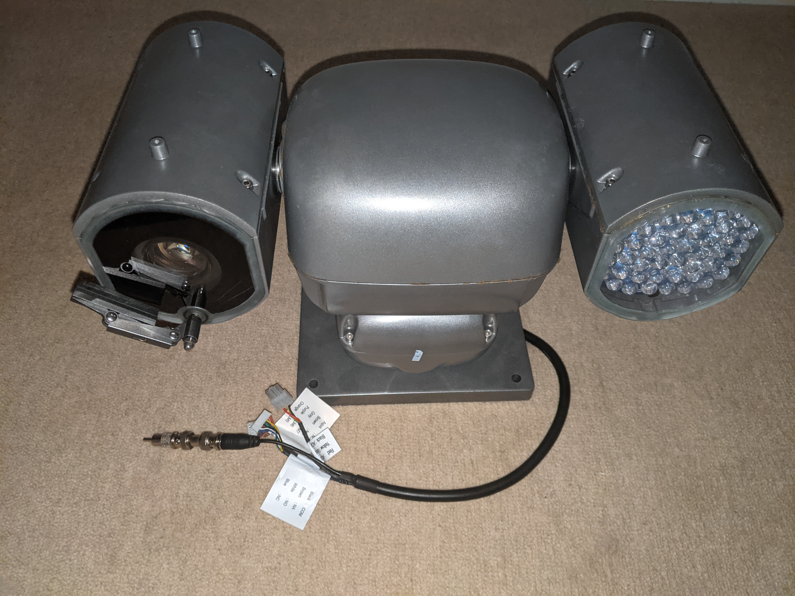
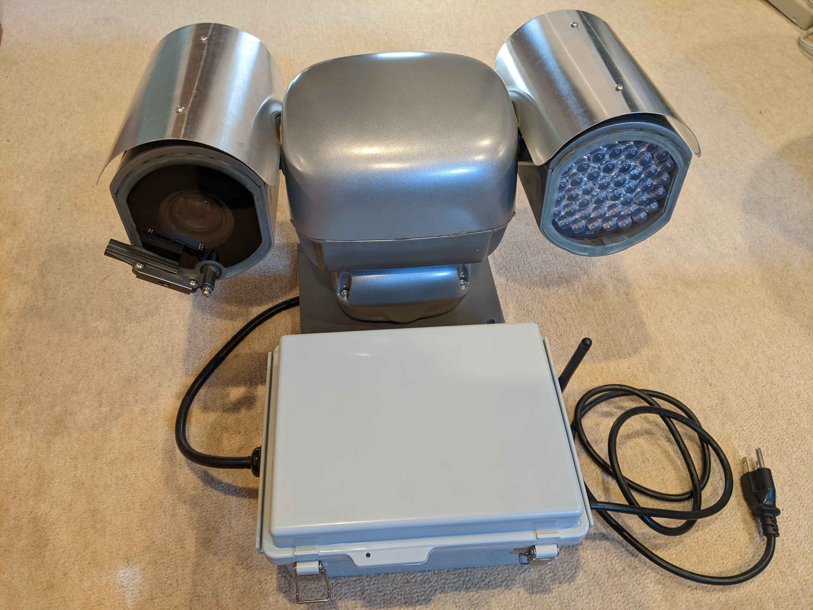
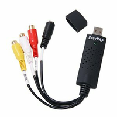
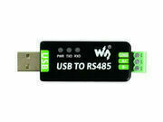
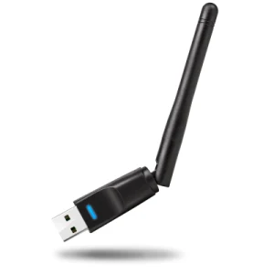

# avuePZT
Application for controlling and viewing video from an Avue G50IR-WB36N PZT camera

[Avue Camera Information](docs/avue.md)

[Pelco PZT Control Protocol Information](docs/pelco.md)

## Controller

The controller is responsible for streaming video from the camera to a remote display, and receiving commands to direct the PZT (pan/zoom/tilt) platform as well as the other camera functions (e.g., zoom in/out, focus near/far/auto, backlight compensation, contrast, IR-mode, wiper, etc.).

It is enclosed in a weatherproof (NEMA) box which connects to the Avue camera via its cable harnass and plugs into the 110VAC power.  Enclosed is the (24 VAC) power supply for the Avue camera and a (USB +5 VDC) power supply for the Raspberry Pi and its peripherals.

### Hardware

The control unit consists of a Raspberry Pi 3B+ with three USB dongles -- one to digitize the video, another to send (Pelco) commands to the camera via RS485, and a WiFi with external antenna.

#### NTSC Video Digitizer USB Dongle
* Fushicai USBTV007 Video Grabber (EasyCAP)
  - ID 1b71:3002

#### Future Technology Devices USB to RS485 Dongle
* idVendor=0403, idProduct=6001, bcdDevice= 6.00
* FTDI USB Serial Device converter
* /dev/ttyUSB0
* install udev rules for USB dongle and reload udevd
  - sudo cp ./99-dtech-rs422_485.rules /etc/udev/rules.d/
  - sudo udevadm control --reload-rules
  - sudo udevadm trigger

#### WiFi Dongle
* Ralink Technology, Corp. RT5370 Wireless Adapter
  - ID 148f:5370
* disable on-board WiFi
  - use this as it has an external antenna

### Software

The Raspi uses it's internal H264 encoder to compress the video from the digitizer and streams it over the WiFi connection.  A good WiFi signal is required to ensure good quality video.

The temperature and WiFi signal quality are continuously monitored and logged via my [SensorNet](https://github.com/jduanen/SensorNet) project.

#### Temperature
* command-line tool to read system temperature
  - vcgencmd measure_temp

#### RSSI
* command-line tool to get the WiFi signal strength
  - iwlist wlan0 scan | egrep dBm

#### Web-Server
* Flask-based python app
* Using the ???? web server

#### Streaming Video
* server
  - ffmpeg -fflags +genpts+igndts -i /dev/video0 -c:v h264_omx -an -b:v 12M -f mpegts - | cvlc -I dummy - --sout='#std{access=http,mux=ts,dst=:8554}'

* client
  - vlc http://avue:8554

===================================================================================
sudo apt install x264
cvlc -vvv v4l2:///dev/video0 --sout '#transcode{vcodec=h264,vb=800,acodec=none}:rtp{sdp=rtsp://:8554/}'

cvlc -vvv v4l2:///dev/video0 --sout '#transcode{vcodec=mp2v,vb=800,acodec=none}:rtp{sdp=rtsp://:8554/}'

cvlc -vvv v4l2:///dev/video0:chroma=mp2v --v4l2-width 1280 --v4l2-height 720 --sout '#transcode{vcodec=mp2v,acodec=mpga,fps=30}:rtp{mux=ts,sdp=rtsp://:8888/live.sdp}'

* using HW encode:
  - ffmpeg -i /dev/video0 -c:v h264_v4l2m2m -b:v 8M -f mpegts udp://192.168.166.216:8999
  - options
    * -framerate 25 -fflags +genpts -re
    * -vcodec libx264 -preset veryfast -pix_fmt yuv420p -strict -2 -y -f mpegts -r 25 udp://239.0.0.1:1234?pkt_size=1316

* client side:
  - vlc -vvv --network-caching 200 rtsp://192.168.166.216:8554/
  - vlc -vvv udp://192.168.166.216:8999

* enable port 5000 on gpuServer1
  - sudo iptables -A INPUT -p tcp --dport 5000 -j ACCEPT
  - sudo apt-get install iptables-persistent
  - sudo ufw allow 5000/tcp

* test port access
  - python3 -m http.server 8000

* Local viewing with mplayer:
  - mplayer tv:// -tv device=/dev/video4:input=0:norm=NTSC -vo x11

* Remote serving with vlc:
  - source device: v4l2:///dev/video0

--------------------------------------------------------------------------------------------------
* OpenMAX and MMAL are the only platform APIs available on Raspi
* Video format of capture device
  - 720x480, yuyv422, interlaced
  - packet size: 691,200, stride: 1440
* ffmpeg
  - yuv420p, bicubic, auto-scaler_0

  - ffmpeg -fflags +genpts+igndts -pix_fmt yuv420p -i /dev/video0 -c:v h264_v4l2m2m -b:v 8M -f mpegts - | cvlc -I dummy - --sout='#std{access=http,mux=ts,dst=:8554}'
  - ffmpeg -i /dev/video0 -c:v h264_v4l2m2m -b:v 8M -f mpegts - | cvlc -I dummy - --sout='#std{access=http,mux=ts,dst=:8554}'
  - ffmpeg -i /dev/video0 -c:v h264_omx -b:v 8M -f mpegts - | cvlc -I dummy - --sout='#std{access=http,mux=ts,dst=:8554}'
  - ffmpeg -fflags +genpts+igndts -i /dev/video0 -c:v h264_omx -an -b:v 10M -progress pipe:2 -f mpegts - | cvlc -I dummy - --sout='#std{access=http,mux=ts,dst=:8554,acodec=none}'

===================================================================================
* read temperature
  - alias temp='/opt/vc/bin/vcgencmd measure_temp'

* monitor temp and RSSI
  - while true; do vcgencmd measure_temp; sleep 30; iwlist wlan0 scan | egrep dBm; done

* setup avue services
  - sudo cp avue<svc>.service /lib/systemd/system/avue<svc>.service
  - sudo systemctl daemon-reload
  - sudo systemctl enable avue<svc>
  - sudo systemctl start avue<svc>
  - sudo systemctl status avue<svc>

===================================================================================

## TODO
* make a tool to set the camera's baudrate
* make a tool that allows CLI-based control of the camera
* enable systemd watchdogs to ensure applications are all running
* figure out how to reduce latency of video streaming
* create default startup state for controller
