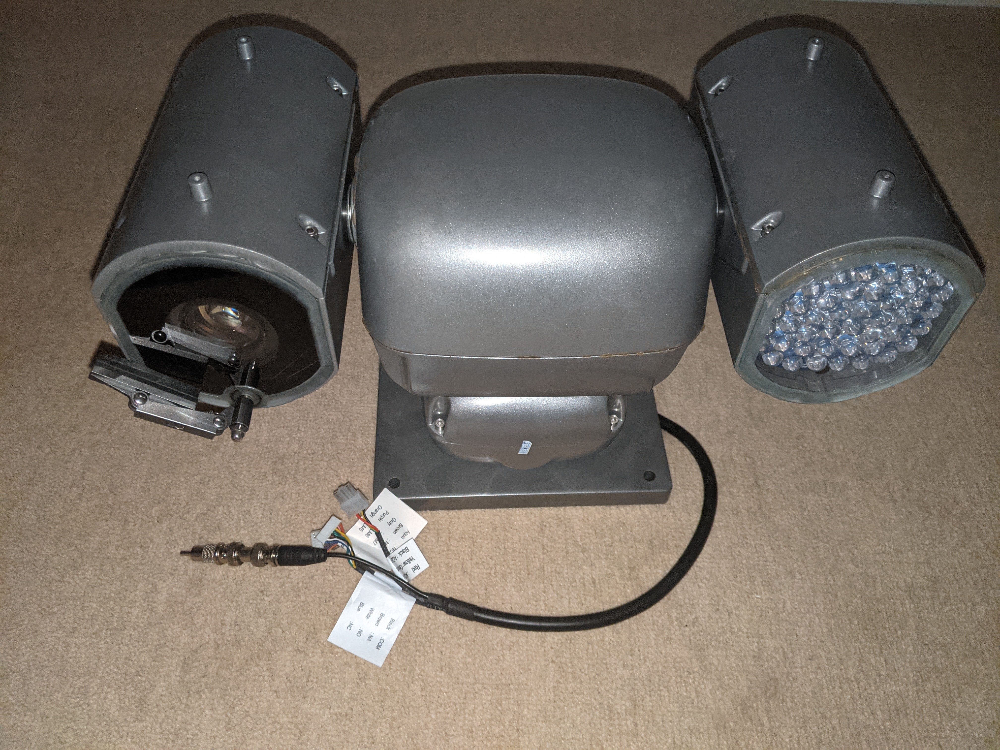
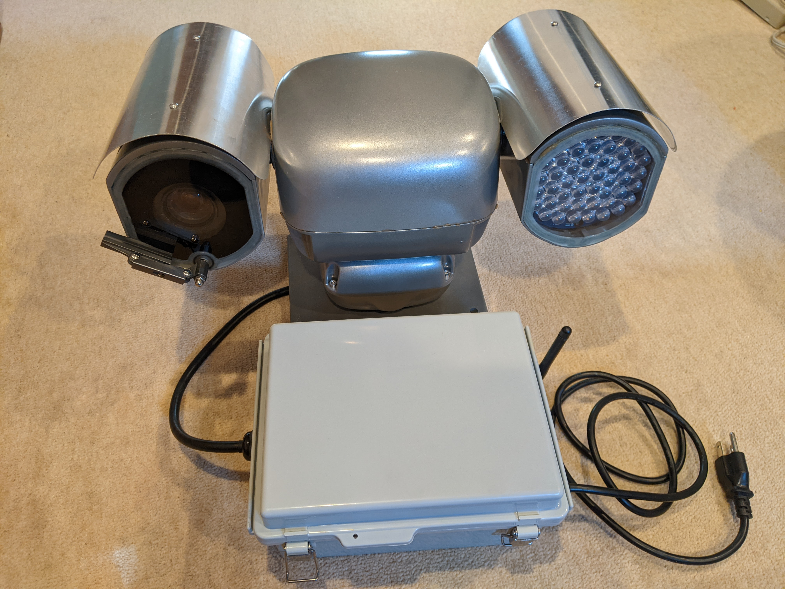
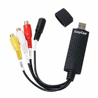
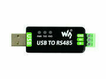

# avuePTZ
Application for controlling and viewing video from an Avue G50IR-WB36N PTZ (Pan/Tilt/Zoom) camera



[Avue Camera Information](docs/avue.md)

[Pelco Control Protocol Information](docs/pelco.md)

## Controller

The controller streams live video from the camera to any browser and accepts commands to control
the PTZ platform and camera functions (zoom, focus, IR illuminator, wiper, backlight compensation, etc.).

It is enclosed in a weatherproof (NEMA) box which connects to the Avue camera via its cable harness
and plugs into 110VAC power. Enclosed is a 24VAC supply for the camera and a USB 5VDC supply for
the Raspberry Pi and its peripherals.



## Hardware

The control unit is a Raspberry Pi 4B (2GB) with two USB dongles — one to digitize the analog video,
one to send Pelco-D commands to the camera over RS485.
The Pi has been modified with a U.FL connector for an external WiFi antenna.

### NTSC Video Digitizer — Fushicai USBTV007 (EasyCAP)

* USB ID: 1b71:3002
* Captures 720x480 YUYV 4:2:2, interlaced (NTSC 480i)
* Device node: **`/dev/video1`**
  - The Pi 4's bcm2835 codec and ISP kernel drivers claim `/dev/video10`–`/dev/video23`,
    pushing the USB grabber to `/dev/video1`. Do not assume `/dev/video0`.
* Verify after boot:
  ```bash
  v4l2-ctl --list-devices          # confirms usbtv on /dev/video1
  v4l2-ctl -d /dev/video1 --list-formats-ext
  ```



### RS485 Serial Interface — FTDI USB-to-RS485 Dongle

* USB ID: 0403:6001
* Device node: `/dev/ttyUSB0`
* Sends Pelco-D commands to the camera (4800 baud, 8-N-1)
* Install udev rules so the device gets a stable name:
  ```bash
  sudo cp ./99-dtech-rs422_485.rules /etc/udev/rules.d/
  sudo udevadm control --reload-rules
  sudo udevadm trigger
  ```



## Software

### Architecture

`avuePTZ.py` is a Flask application that handles both video and PTZ control:

* **Video**: A background thread runs FFmpeg continuously, capturing from `/dev/video1`,
  deinterlacing the 480i NTSC source with `yadif`, and encoding JPEG frames in software.
  The latest frame is stored in a shared memory buffer. The `/snapshot` endpoint returns
  the current frame as `image/jpeg`. The browser polls `/snapshot` in a tight loop and
  draws frames to a `<canvas>` element using `createImageBitmap`. This approach works
  in all browsers including Chrome on Android, which does not support MJPEG in `` tags
  and does not reliably stream HTTP responses via `fetch()`.

* **PTZ control**: HTTP endpoints (`/move`, `/zoom`, `/focus`, `/IR`, `/wiper`, `/home`,
  `/zoomWide`, etc.) send Pelco-D commands over RS485 via `pyserial`. The browser sends
  commands on `mousedown`/`touchstart` and stops on `mouseup`/`touchend`, giving
  hold-to-move behavior with minimal latency.

* **Pelco-D protocol**: Implemented in `Pelco.py`. The `AVUE` class in `avuePTZ.py`
  extends it with camera-specific commands (IR preset 62, wiper preset 63, `GotoZeroPan`
  for home).

### Installation (Raspberry Pi OS Lite, Trixie / Debian 13)

#### 1. System packages

```bash
sudo apt install git ffmpeg python3-systemd python3-serial
```

`python3-systemd` and `python3-serial` **must** come from apt. They cannot be
pip-installed on Trixie (PEP 668 / externally-managed-environment). The `systemd`
Python package on PyPI does not include the `Notification` class present in older
versions; the apt package is used instead, with a local shim defined in `avuePTZ.py`.

#### 2. Python environment

```bash
cd ~/Code/avuePTZ
python3 -m venv --system-site-packages venv
source venv/bin/activate
pip install -r requirements.txt      # flask, pyserial, pyyaml
```

`--system-site-packages` lets the venv see the apt-installed `systemd` and `serial` modules.

#### 3. Udev rules

```bash
sudo cp ./99-dtech-rs422_485.rules /etc/udev/rules.d/
sudo udevadm control --reload-rules && sudo udevadm trigger
```

#### 4. Systemd services

```bash
sudo cp avueControl.service avueLogger.service /lib/systemd/system/
sudo systemctl daemon-reload
sudo systemctl enable avueControl avueLogger
sudo systemctl start avueControl avueLogger
sudo systemctl status avueControl avueLogger
```

| Service | Description |
|---|---|
| `avueControl` | Flask PTZ controller + video capture (port 8080) |
| `avueLogger` | MQTT telemetry (CPU temp, WiFi RSSI) to SensorNet |

`avueVideo.service` is **permanently disabled**. The Flask app owns `/dev/video1` directly
via its background capture thread. Do not re-enable `avueVideo.service`.

### Web Interface

Navigate to `http://avue.lan:8080` in any browser — redirects automatically to `/camera`.

Works on desktop (Brave, Firefox, Chrome) and mobile (Chrome on Android).

**Controls on `/camera`:**

| Control | Behavior |
|---|---|
| D-pad (8 directions) | Hold to move, release to stop |
| ⌂ center button | Home: `GotoZeroPan` Pelco command |
| Speed slider | Pan/tilt speed 0–63 |
| Zoom +/− | Hold to zoom in/out |
| Zoom Wide | Zooms out for 5 s (reaches full wide from any position) |
| Focus Near/Far | Hold to adjust; AF toggle hides manual buttons |
| IR | Toggle IR illuminator and ICR filter |
| Wiper | Triggers one wiper cycle; button locks for 30 s |

Additional legacy pages: `/motion` (desktop, no video), `/mobile` (mobile, no video).

### Monitoring

```bash
# CPU temperature (Trixie — vcgencmd is in PATH, not /opt/vc/bin)
vcgencmd measure_temp

# WiFi RSSI
iwlist wlan0 scan | grep dBm

# Continuous
while true; do vcgencmd measure_temp; iwlist wlan0 scan | grep dBm; sleep 30; done
```

CPU temperature and WiFi RSSI are also published via MQTT to the
[SensorNet](https://github.com/jduanen/SensorNet) project by `avueLogger.service`.

### Troubleshooting

**No video / black canvas:**
1. Check the video device exists: `ls /dev/video*` — should include `/dev/video1`
2. Check the usbtv kernel module: `lsmod | grep usbtv` — load with `sudo modprobe usbtv` if missing
3. Check Flask log for `FFmpeg:` error lines — the capture loop logs FFmpeg stderr on failure
4. Verify the USB dongle is recognized: `lsusb | grep 1b71`

**Movement commands return 500:**
* Pan/tilt speed must be in range 0–63 or exactly 255 (Pelco-D limit). Values 64–254 are invalid
  and will raise an assertion error. The speed slider is clamped to 0–63.

**`from systemd.daemon import Notification` ImportError:**
* The Debian `python3-systemd` package does not export `Notification`. A local shim class
  is defined in `avuePTZ.py` — do not add `systemd-python` from PyPI.

## TODO
* Make a tool to set the camera's baudrate
* Make a tool for CLI-based camera control
* Enable systemd watchdog integration in `avueControl.service`
* Create a defined startup state for the camera (position, zoom, focus, IR)
